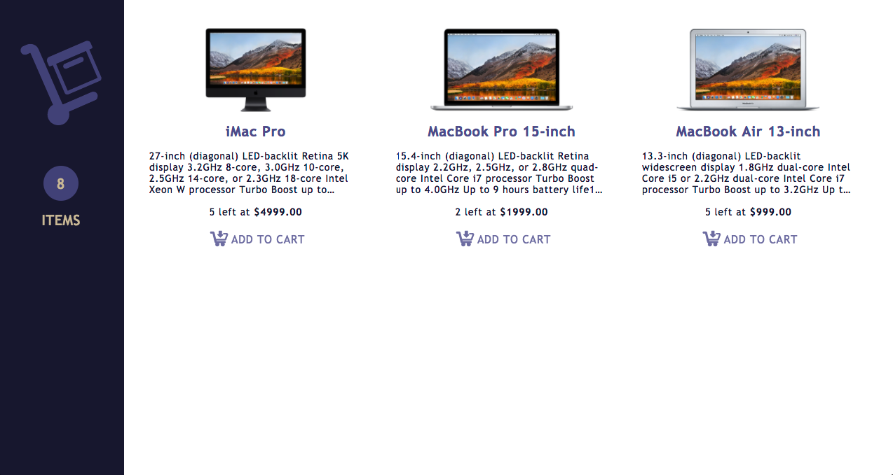
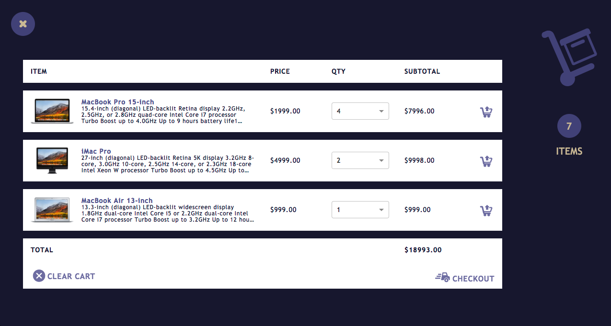

# Moltin Cart

## Some screenshots to engage:
### Home page

### The cart


## Project Setup
I've used npm -v `5.6.0` and node -v `8.9.1`. And everything kinda works.
I think it should work fine on higher version and may work on lower version, but I haven't test.
Ping me if you have any issues with that.
The following libraries are user:
* [React.js](https://reactjs.org/) as a rendering library
* [Next.js](https://github.com/zeit/next.js/) as SSR solution and starter-kit
* [Redux](https://redux.js.org/) as a state management
* [Redux Saga](https://redux-saga.js.org/) as a side effects management library
* [SCSS](https://sass-lang.com/) as CSS extension
* [Jest](https://facebook.github.io/jest/) as a testing platform
* A little bit of [Flexbox Grid](http://flexboxgrid.com/)
* [Prettier](https://prettier.io) to make the code look good and consistent
* ... and some more libraries for cookies manipulations, memoized bindings, resetting browser css etc.

## Config
Also, the project uses [Motlin API](https://docs.moltin.com).
Of course, we're extremely secure and we didn't put our client id in the repo.
So, please, create your own `moltin.config.json` in the root containing at least you `client_id`:
```
{
  "client_id": "YOUR_CLIENT_ID"
}

```

To install needed npm packages run the following:
```
npm i
```

## NPM scripts
* `npm run dev` starts the server with hot reloading at `localhost:3000`
* `npm run build` creates a production build in `.build` folder
* `npm start` starts the build from above
* `npm run prettier` prettifies the code
* `npm run test` runs the jest tests

## What wasn't done, but was desirable:
* Mobile support. It was planned to be an adaptive app, so maybe one day...
* Good looking notifications (when adding to cart, deleting, etc.)
* !!! Do some tests. Now they're only testing only very basic rendering.

## Other things used and thank you's
* [Color palette](http://color.farm/type-and-colors)
* [Design examples](https://www.templatemonster.com/blog/shopping-cart-page-designs/)
* [Icons](https://www.flaticon.com/) - specifically [this](https://www.flaticon.com/packs/electronic-commerce) package.
* [Mockplus](https://www.mockplus.com) - app for creating low-fidelity mockups. Not so good, but free.


